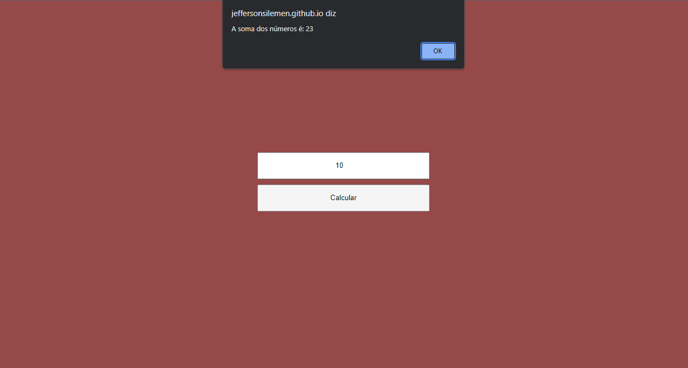

	
  

  

  

   Teste prático Escribo.

   

  <a href="#clipboard-sobre-o-projeto">Sobre o Projeto</a>&nbsp;&nbsp;&nbsp;|&nbsp;&nbsp;&nbsp;
  <a href="#computer-tecnologias-utilizadas">Tecnologias</a>&nbsp;&nbsp;&nbsp;|&nbsp;&nbsp;&nbsp;
  <a href="#closed_book-licença">Licença</a>

 Para rodar o projeto basta clicar no  <a href="https://jeffersonsilemen.github.io/testeEscribo/">link</a>.

## :clipboard: Sobre o Projeto

Desafio Técnico
- Implemente uma função que receba um número inteiro positivo e retorne o somatório de todos os valores
inteiros divisíveis por 3 ou 5 que sejam inferiores ao número passado.

Exemplos:
- Caso sua função receba o inteiro 10, ela deve retornar 23, resultante do somatório dos números 3, 5, 6 e
9 que são menores que 10.
- Caso sua função receba o inteiro 11, ela deve retornar 33, resultante do somatório dos números 3, 5, 6, 9
e 10 que são menores que 11.

## :computer: Tecnologias utilizadas

  
  
  
  

Skills:

- HTML
- CSS
- JavaScript

## :closed_book: Licença

Esse projeto está sob a licença MIT. Veja o arquivo [LICENSE](https://github.com/JeffersonSilemen/frontendMentor5/blob/main/LICENSE) para mais detalhes.
